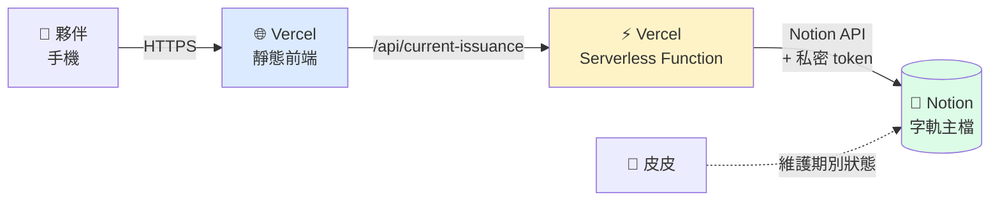
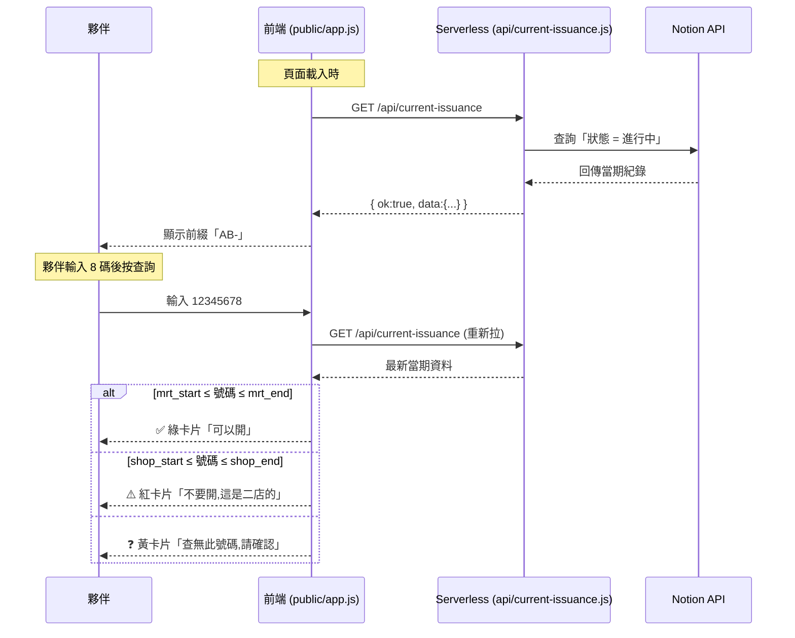

# SPEC-字軌越界判斷工具

> 文件版本:v1.0
> 產出日期:2026-04-28
> 適用對象:Claude Code(IDE AI)
> 開發者:皮皮(初學者,需 step-by-step 引導)

---

## 1. Project Overview(專案總覽)

**專案名稱**:字軌越界判斷工具

**一句話定義**:給捷運擺攤點夥伴在現場開發票前用的越界判斷小工具——輸入 8 碼數字,系統 5 秒內回答「能開 / 不能開 / 查無此號」,從根源消除越界開立發票的風險。

**背景**:每兩個月二店收到 1004 本字軌,拆 500 本給捷運擺攤點。現場若不慎開到二店範圍的號碼,會造成兩邊系統認知不一致、重複開立發票。本工具是「字軌系統」的查詢前端,讓現場夥伴零摩擦判斷號碼歸屬。

**核心價值**:
- 對夥伴:5 秒內知道「能不能開」,不必自己對照範圍表
- 對皮皮(管理者):從源頭預防越界,不必事後補救
- 對系統:Notion 字軌主檔仍是 Source of Truth,本工具完全只讀

---

## 2. Target Environment & Setup(開發環境與環境建置)

### 2-1. 技術堆疊

| 項目 | 選用 | 備註 |
|------|------|------|
| 前端 | 純 vanilla HTML + CSS + JavaScript | 不用框架,此 app 簡單到不需要 |
| 後端代理 | Vercel Serverless Function (Node.js) | 解決 CORS + 隱藏 API key |
| 資料源 | Notion API | 字軌主檔 data_source_id: `f0359983-d5c3-465a-89b0-e27bed5178ab` |
| 部署 | Vercel(免費方案) | `[建議]` 對非工程背景使用者最友善 |
| 版本控管 | Git + GitHub | 公開或私有 repo 皆可 |
| IDE AI | Claude Code | |

### 2-2. 環境初始化步驟

> **皮皮從零開始的指令清單**(假設 macOS)

**Step 1:安裝必要工具(若尚未安裝)**

```bash
# 確認 Node.js 已安裝(需 v18+)
node --version

# 若無 Node.js,用 Homebrew 安裝
brew install node

# 安裝 Vercel CLI(用來部署)
npm install -g vercel
```

**Step 2:建立專案資料夾**

```bash
mkdir invoice-serial-checker
cd invoice-serial-checker
git init
npm init -y
```

**Step 3:安裝相依套件**

```bash
# 後端 serverless function 需要的套件
npm install @notionhq/client

# 開發用工具
npm install --save-dev vercel
```

**Step 4:建立 .env.example 與 .gitignore**(秘密管理底線)

`.env.example`(可 commit,給未來的自己參考):
```
# Notion Integration Token,從 https://www.notion.so/profile/integrations 取得
# 必須是「專屬給這個 app 的 Integration」,且只 share 給「字軌主檔」資料庫
NOTION_TOKEN=ntn_xxxxxxxxxxxxxxxxxxxxxxxxxxxxxxxx

# Notion 字軌主檔的 data_source_id
NOTION_DATA_SOURCE_ID=f0359983-d5c3-465a-89b0-e27bed5178ab
```

`.gitignore`(必須加入,絕對不能漏):
```
.env
.env.local
node_modules/
.vercel/
.DS_Store
```

`.env`(本機開發用,**絕對不 commit**):
```
NOTION_TOKEN=<皮皮去 Notion 取得後填入>
NOTION_DATA_SOURCE_ID=f0359983-d5c3-465a-89b0-e27bed5178ab
```

### 2-3. 取得 Notion API Key(必做,不可省略)

> 這一步皮皮自己做,不交給 AI

1. 前往 https://www.notion.so/profile/integrations
2. 點「+ New integration」
3. 名稱填:「字軌越界判斷工具」(讓未來的自己一看就懂這把 key 是給誰用的)
4. 類型選「Internal」
5. 建立後取得 `ntn_` 開頭的 token
6. **關鍵步驟**:回到 Notion 的「字軌主檔」頁面,右上角 ··· → Connections → 把剛才建立的「字軌越界判斷工具」加進來
7. **絕對不要**把這把 key share 給其他敏感頁面(營運 DB、人資資料等)

### 2-4. 冒煙測試

```bash
# 啟動本機開發伺服器
vercel dev
```

**預期輸出**:
```
> Ready! Available at http://localhost:3000
```

打開瀏覽器到 `http://localhost:3000`,看到「字軌越界判斷工具」標題即代表環境活著。

---

## 3. File & Folder Structure(檔案結構)

```
invoice-serial-checker/
├── README.md                          # 專案說明(Sprint 結案時建立)
├── CHANGELOG.md                       # 變更紀錄(Sprint 0 建立,每 Sprint 更新)
├── .env.example                       # 環境變數範本
├── .gitignore                         # Git 忽略清單
├── .env                               # 本機環境變數(不 commit)
├── package.json                       # npm 設定
├── package-lock.json                  # npm 鎖定
├── vercel.json                        # Vercel 部署設定
│
├── public/                            # 前端靜態檔(Vercel 自動服務這個資料夾)
│   ├── index.html                     # 主畫面
│   ├── style.css                      # 樣式
│   └── app.js                         # 前端邏輯
│
└── api/                               # Vercel Serverless Functions(自動成為 /api/* endpoint)
    └── current-issuance.js            # 取得當期字軌資料的 API
```

---

## 4. Core Features & Acceptance Criteria(核心功能與驗收標準)

| # | 功能 | 完成的定義 |
|---|------|-----------|
| F1 | 載入時抓取當期字軌 | 開啟頁面後 3 秒內,輸入框前方顯示當期前綴(例:「AB-」) |
| F2 | 輸入限制 | 輸入框只接受數字,貼上含字母的文字會自動過濾 |
| F3 | 空白輸入處理 | 輸入框空白時按查詢,顯示「請輸入號碼」黃色提示,不發 API |
| F4 | 長度檢查 | 輸入長度非 8 碼時按查詢,顯示「號碼長度不對,請確認」黃色提示,不發 API |
| F5 | 捷運範圍判斷 | 號碼在當期捷運範圍內 → 顯示綠色卡片「✅ 可以開」 |
| F6 | 二店範圍判斷 | 號碼在當期二店範圍內 → 顯示紅色卡片「⚠️ 不要開,這是二店的」 |
| F7 | 查無此號 | 號碼不在當期任何範圍 → 顯示黃色卡片「❓ 查無此號碼,請確認」 |
| F8 | 再查一次 | 結果卡片下方有按鈕,點下後清空輸入框並 focus |
| F9 | API 連線失敗處理 | Notion API 失敗時顯示紅色橫幅,查詢按鈕變灰色不可按 |
| F10 | 字軌主檔狀態異常處理 | 「進行中」狀態的紀錄不是 1 筆時,顯示「字軌主檔狀態異常,請聯絡皮皮」 |

---

## 5. Data Structure(資料結構)

### 5-1. Notion 字軌主檔(讀取對象,**不修改**)

| Notion 欄位名 | 內部標準化名稱 | 型別 | 說明 |
|-------------|---------------|------|------|
| 期別 | period | string | 例:「2026 年 5-6 月期」 |
| 字軌前綴 | prefix | string | 2 碼英文,例:「AB」 |
| 整批起號 | batch_start | number | 1004 本中第 1 張的 8 碼 |
| 整批迄號 | batch_end | number | 第 1004 本最後 1 張的 8 碼 |
| 二店 iChef 範圍起 | shop_start | number | |
| 二店 iChef 範圍迄 | shop_end | number | |
| 捷運範圍起 | mrt_start | number | |
| 捷運範圍迄 | mrt_end | number | |
| 狀態 | status | enum | 「未來」/「進行中」/「已結束」 |

### 5-2. Serverless Function 回傳給前端的格式

```
GET /api/current-issuance

回應(成功):
{
  "ok": true,
  "data": {
    "period": "2026 年 5-6 月期",
    "prefix": "AB",
    "shop_start": 12300001,
    "shop_end": 12325200,
    "mrt_start": 12325201,
    "mrt_end": 12350200
  }
}

回應(失敗):
{
  "ok": false,
  "error": "NOTION_API_FAILED" | "MULTIPLE_ACTIVE_PERIODS" | "NO_ACTIVE_PERIOD" | "MISSING_FIELDS",
  "message": "給人看的中文錯誤訊息"
}
```

### 5-3. 前端內部狀態

```
{
  loading: false,
  error: null | "NOTION_API_FAILED" | ...,
  currentIssuance: { ...上面那包 } | null,
  inputValue: "12345678",
  result: null | "MRT_OK" | "SHOP_BLOCK" | "NOT_FOUND" | "EMPTY" | "WRONG_LENGTH"
}
```

---

## 6. Logic & Data Flow(邏輯與資料流)

### 6-1. 整體系統架構



### 6-2. 單次查詢時序



### 6-3. 判斷邏輯虛擬碼

```
function judgeNumber(input, current):
  if input is empty:
    return "EMPTY"
  if input.length != 8:
    return "WRONG_LENGTH"

  num = parseInt(input)

  if current.mrt_start <= num <= current.mrt_end:
    return "MRT_OK"        // 綠
  if current.shop_start <= num <= current.shop_end:
    return "SHOP_BLOCK"    // 紅
  return "NOT_FOUND"       // 黃
```

### 6-4. Serverless Function 邏輯虛擬碼

```
async function GET /api/current-issuance:
  try:
    response = await notion.query({
      data_source_id: NOTION_DATA_SOURCE_ID,
      filter: { property: "狀態", select: { equals: "進行中" } }
    })

    if response.results.length == 0:
      return { ok: false, error: "NO_ACTIVE_PERIOD", message: "字軌主檔沒有進行中期別" }
    if response.results.length > 1:
      return { ok: false, error: "MULTIPLE_ACTIVE_PERIODS", message: "字軌主檔有多筆進行中期別" }

    page = response.results[0]
    data = mapNotionToStandard(page)  // 中文欄位 → 英文標準欄位

    if any required field is null/undefined:
      return { ok: false, error: "MISSING_FIELDS", message: "當期字軌欄位不完整" }

    return { ok: true, data }
  catch (e):
    return { ok: false, error: "NOTION_API_FAILED", message: "無法連線到字軌主檔" }
```

---

## 7. UI/UX Description(介面描述)

### 7-1. 設計原則(沿用需求文件)

- **手機優先**:所有互動元素 ≥ 44pt 觸控區
- **大色塊卡片**:結果區用整塊背景色,夥伴一眼分辨
- **大圓角**:卡片 16-20px,輸入框 12px
- **粗厚字體**:結果文字用 700+ 字重,號碼用等寬字體
- **米白底色**:背景 `#FAF7F2` 類似紙張,降低視覺壓力
- **大量留白**:單一畫面只有「輸入框 + 按鈕 + 結果」,沒有任何裝飾

### 7-2. 主畫面結構(由上至下)

```
┌─────────────────────────────┐
│  字軌越界判斷                 │  ← 標題,粗字
│  2026 年 5-6 月期             │  ← 當期期別,小字灰色
├─────────────────────────────┤
│                             │
│   ┌──┐ ┌─────────────────┐  │
│   │AB│ │  輸入 8 碼數字     │  │  ← 灰標籤 + 大輸入框
│   └──┘ └─────────────────┘  │
│                             │
│   ┌─────────────────────┐   │
│   │      查 詢          │   │  ← 主按鈕,深色,大
│   └─────────────────────┘   │
│                             │
│   [結果卡片區,初始隱藏]       │
│                             │
└─────────────────────────────┘
```

### 7-3. 結果卡片三種狀態

**綠卡片(可以開)**
- 背景:`#16A34A`(深綠)
- 文字白色
- 大圖示 ✅
- 主標:「可以開」(48pt,粗體)
- 副標:「12345678 在當期捷運範圍內」(16pt)
- 下方「再查一次」按鈕

**紅卡片(不要開,二店的)**
- 背景:`#E76F51`(珊瑚紅)
- 主標:「不要開,這是二店的」(36pt,粗體)
- 副標:「12345678 屬於二店 iChef 範圍」
- 下方「再查一次」按鈕

**黃卡片(查無此號)**
- 背景:`#E9C46A`(芥末黃)
- 文字深灰 `#1F2937`(對比度足夠)
- 主標:「查無此號碼,請確認」(36pt,粗體)
- 副標:「12345678 不在當期任何範圍內,可能是過期或打錯」
- 下方「再查一次」按鈕

### 7-4. 錯誤橫幅(API 失敗或主檔異常)

- 紅色橫幅貼在畫面最頂端
- 文字:「⚠️ 系統異常,請聯絡皮皮」+ 具體錯誤類型
- 此狀態下查詢按鈕變灰色不可按

---

## 8. Step-by-Step Implementation Plan(分階段實作指南)

> **本專案不含進階自動化測試**(初學者 + 簡單專案),手動測試為主。

### Sprint 0:環境建置

**目標**:把開發環境架起來,冒煙測試通過,秘密管理架構就位。

**【複製專用 Prompt】**
```
請依照 SPEC 第 2 節「Target Environment & Setup」初始化專案。具體做:
1. 建立資料夾結構(public/、api/),建立空的 index.html、app.js、style.css、current-issuance.js
2. 建立 package.json,安裝 @notionhq/client
3. 建立 .env.example、.gitignore、.env(.env 內 NOTION_TOKEN 先留空字串給我自己填)
4. 建立 vercel.json(基本設定即可)
5. 在 index.html 寫一個只顯示「字軌越界判斷工具」標題的最小頁面
6. 建立 CHANGELOG.md,寫入第一筆「Sprint 0 環境建置完成」
7. 不要寫 README.md,留到結案 Sprint 寫
完成後告訴我怎麼跑 vercel dev 看到那個標題。
```

**驗證標準**:
1. 跑 `vercel dev` 終端機顯示 `Ready! Available at http://localhost:3000`
2. 瀏覽器打開 localhost:3000 看到「字軌越界判斷工具」標題
3. 確認 .env 沒有被 git 追蹤(`git status` 看不到 .env)
4. CHANGELOG.md 已建立並有第一筆紀錄

**📝 更新 CHANGELOG.md**:Sprint 0 建立檔案,寫入環境建置完成。

**⏸️ Pause Point**:在此停下,皮皮自己去 Notion 建立 Integration 並把 token 填入 .env,再繼續 Sprint 1。

---

### Sprint 1:Serverless Function(資料源驗證,最高風險的 Sprint)

**目標**:`/api/current-issuance` 能正確從 Notion 抓到當期資料,並做欄位標準化。

**【複製專用 Prompt】**
```
請實作 api/current-issuance.js,功能依 SPEC 第 6-4 節虛擬碼:
1. 用 @notionhq/client 連線(從 process.env.NOTION_TOKEN 讀)
2. 對 process.env.NOTION_DATA_SOURCE_ID 查詢「狀態 = 進行中」的頁面
3. 處理 4 種錯誤情境:NO_ACTIVE_PERIOD、MULTIPLE_ACTIVE_PERIODS、MISSING_FIELDS、NOTION_API_FAILED,回傳格式依 SPEC 第 5-2 節
4. 成功時把中文欄位轉成英文標準欄位(對照表在 SPEC 第 5-1 節)
5. 加上 CORS header 允許自家前端呼叫(其實同源不需要,但保險起見加上)

注意:Notion API 的 select 欄位篩選語法、欄位讀取的巢狀結構(properties.字軌前綴.rich_text[0].plain_text 這種),請查 @notionhq/client 文件,不要用記憶中的版本。
```

**驗證標準**:
1. 跑 `vercel dev`,瀏覽器打開 `http://localhost:3000/api/current-issuance`
2. 看到 JSON 回應 `{ "ok": true, "data": { "period": "...", "prefix": "AB", ...} }`
3. 把 .env 的 NOTION_TOKEN 故意改錯一個字,重新整理應該看到 `{ "ok": false, "error": "NOTION_API_FAILED", ...}`
4. 把 token 改回來,確認又能正常拿到資料

**📝 更新 CHANGELOG.md**:追加「Sprint 1: 完成 Notion API 串接 serverless function,可正確讀取當期字軌並處理 4 種錯誤情境」。

**⏸️ Pause Point**:這是最高風險點,確認 API 行為完全正確再進下一階段。

---

### Sprint 2:前端骨架(輸入介面 + API 串接)

**目標**:頁面載入時顯示前綴標籤,輸入框可輸入,按鈕能呼叫 API,但**還不顯示判斷結果卡片**(下一個 Sprint 才做)。

**【複製專用 Prompt】**
```
請實作 public/index.html、public/app.js、public/style.css:
1. HTML:標題、期別小字、前綴標籤(初始為「載入中」)、純數字輸入框(inputmode="numeric")、查詢按鈕、結果區(暫時空白)
2. JS:頁面載入時 fetch('/api/current-issuance'),把回傳的 prefix 填入標籤、period 填入小字
3. 輸入框只允許數字(用 input 事件過濾非數字)
4. 按查詢時:先做空白與長度檢查(SPEC F3、F4),再 fetch 一次 API 拿最新資料,把結果暫時 console.log 出來
5. 若 API 回 ok:false,顯示紅色錯誤橫幅(SPEC F9、F10),查詢按鈕變灰色
6. CSS 使用 SPEC 第 7 節的設計原則(米白底、大圓角、粗字、手機優先 viewport)

注意:不要用任何框架,純 vanilla JS。document.querySelector 加 addEventListener 就夠了。
```

**驗證標準**:
1. 重新整理頁面,前綴標籤從「載入中」變成「AB」(或當期實際前綴)
2. 期別小字顯示「2026 年 5-6 月期」(或當期)
3. 輸入框試貼「AB12345678」應只剩「12345678」
4. 空白按查詢顯示「請輸入號碼」
5. 輸入「123」按查詢顯示「號碼長度不對」
6. 輸入「12345678」按查詢,DevTools console 應印出當期資料
7. 把 .env token 改錯重啟,頁面頂端顯示紅色錯誤橫幅

**📝 更新 CHANGELOG.md**:追加「Sprint 2: 完成前端骨架,輸入介面、長度驗證、API 整合就緒,結果判斷待 Sprint 3」。

**⏸️ Pause Point**:確認所有錯誤分支都會走到對應提示,再進 Sprint 3。

---

### Sprint 3:判斷邏輯 + 三色結果卡片

**目標**:接上前一個 Sprint 的查詢動作,完成判斷邏輯與三色卡片視覺呈現。

**【複製專用 Prompt】**
```
請在 public/app.js 加上判斷邏輯,在 public/style.css 加上三色卡片樣式:
1. 在按查詢的 fetch 成功 callback 中,改成執行 SPEC 第 6-3 節的 judgeNumber 函式
2. 根據結果("MRT_OK"/"SHOP_BLOCK"/"NOT_FOUND")在結果區渲染對應卡片
3. 三色卡片設計依 SPEC 第 7-3 節:綠 #16A34A、珊瑚紅 #E76F51、芥末黃 #E9C46A
4. 卡片內含主標、副標(把使用者輸入的號碼帶進去)、「再查一次」按鈕
5. 「再查一次」按鈕點擊後:清空輸入框、清空結果區、focus 回輸入框

注意:卡片要平滑出現(opacity transition 0.2s 即可,不要太花俏)。
副標的號碼用等寬字體(font-family: 'SF Mono', Menlo, monospace)。
```

**驗證標準**(用今天 Notion 主檔的當期資料測試):
1. 輸入捷運範圍內某號碼 → 綠卡片「可以開」
2. 輸入二店範圍內某號碼 → 紅卡片「不要開,這是二店的」
3. 輸入範圍外的號碼(例如 99999999)→ 黃卡片「查無此號碼」
4. 點「再查一次」按鈕 → 輸入框清空、卡片消失、游標回到輸入框
5. 在手機(或 DevTools 切換成 iPhone 模式)測試,所有觸控區夠大

**📝 更新 CHANGELOG.md**:追加「Sprint 3: 完成核心判斷邏輯與三色結果卡片,功能性開發完畢」。

**⏸️ Pause Point**:此時 app 功能完整,可開始考慮部署。

---

### Sprint 4:部署到 Vercel + 給夥伴試用

**目標**:把 app 部署到 Vercel,取得正式網址,環境變數也搬移過去。

**【複製專用 Prompt】**
```
請協助我把這個專案部署到 Vercel:
1. 先檢查 .gitignore 是否正確、.env 確實沒被追蹤
2. 把專案推上 GitHub(若還沒設 remote,告訴我具體指令)
3. 用 vercel CLI 連結到 Vercel 專案(指令是什麼?需要我做哪些選擇?)
4. 提醒我去 Vercel Dashboard 設定環境變數(NOTION_TOKEN 與 NOTION_DATA_SOURCE_ID),讓 production 能讀到
5. 部署完成後,告訴我怎麼驗證上線網址能正確取資料

部署完之後,告訴我可以怎麼產生短網址或分享連結給 1-3 個夥伴測試。
```

**驗證標準**:
1. Vercel Dashboard 顯示部署成功(綠燈)
2. 打開 production URL 看到頁面正常載入,前綴顯示正確
3. 用手機(不在開發者網路下)打開 URL 也能正常用
4. 找一個夥伴實際在現場用一次,確認體驗順暢

**📝 更新 CHANGELOG.md**:追加「Sprint 4: 部署上線至 Vercel,正式網址可供夥伴使用」。

**⏸️ Pause Point**:確認真正在現場可用後,進入結案 Sprint。

---

## 9. Edge Cases & Error Handling(邊界情況與錯誤處理)

| # | 情境 | 處理方式 |
|---|------|---------|
| E1 | 輸入框空白按查詢 | 顯示「請輸入號碼」黃色提示,不發 API |
| E2 | 輸入長度非 8 | 顯示「號碼長度不對,請確認」黃色提示,不發 API |
| E3 | 輸入含非數字 | 輸入框 input 事件即時過濾,使用者看不到非數字 |
| E4 | Notion API 連線失敗 | 紅色橫幅「無法連線到字軌主檔,請聯絡皮皮」,查詢按鈕變灰色 |
| E5 | 進行中紀錄不是 1 筆 | 紅色橫幅「字軌主檔狀態異常」,具體錯誤代碼帶上(MULTIPLE_ACTIVE_PERIODS / NO_ACTIVE_PERIOD) |
| E6 | 當期紀錄缺欄位 | 紅色橫幅「字軌主檔欄位不完整」 |
| E7 | App 開啟後幾小時皮皮切換期別 | 每次按查詢都重新拉 Notion(不快取) |
| E8 | 同一夥伴連續查很多次 | 不限制,每次都重新拉 Notion(查詢量小,API 完全吃得消) |
| E9 | 網路慢,API 拉超過 3 秒 | 載入轉圈,3 秒後顯示「網路較慢,請稍候或重試」 |
| E10 | 連續查詢 | 結果卡片下方「再查一次」按鈕,清空並 focus |
| E11 | 字軌前綴空白 | 標籤位置顯示「(前綴未設定)」,但仍允許查詢 |

---

## 10. Technical Hurdles & AI Pitfall Warnings(技術坑洞預警)

### 🚨 坑洞 1:CORS 跨域問題

**問題**:純前端直接 `fetch('https://api.notion.com/...')` 會被瀏覽器擋下。

**為什麼 AI 容易犯**:Claude Code 看到「呼叫 Notion API」可能直接寫 fetch 到 notion.com,然後在 header 上瞎加東西想繞過。

**Prompt 修正建議**:
> 「Notion API **絕對不能從前端直接呼叫**(CORS 限制 + token 暴露)。所有 Notion API 呼叫必須走 `api/current-issuance.js` 這個 serverless function,前端只 fetch 自家的 `/api/...` endpoint。」

### 🚨 坑洞 2:Notion API 欄位的巢狀結構

**問題**:Notion API 回傳格式是巢狀的,例如取「字軌前綴」要寫 `page.properties.字軌前綴.rich_text[0].plain_text`(text 型別)、取「捷運範圍起」要寫 `page.properties.捷運範圍起.number`(number 型別)。AI 經常猜錯結構。

**為什麼 AI 容易犯**:不同型別欄位的結構不同(title/rich_text/number/select/date 各有自己的形狀),容易拿訓練資料的舊版本格式硬套。

**Prompt 修正建議**:
> 「請查 @notionhq/client 最新文件確認每個欄位型別的取值路徑。本專案會用到 title(期別)、rich_text(字軌前綴)、number(範圍欄位)、select(狀態)四種型別。先用 console.log 印出 API 回傳的原始 JSON,**確認結構後再寫取值程式碼**,不要憑記憶寫。」

### 🚨 坑洞 3:Notion 欄位名包含中文 + 全形空格

**問題**:「二店 iChef 範圍起」這個欄位名稱中間是**全形空格**還是半形空格?打錯一個就 undefined,且 JS 不會報錯。

**為什麼 AI 容易犯**:複製貼上時編輯器可能轉換空格類型;手動打字時容易漏空格或打錯。

**Prompt 修正建議**:
> 「Notion 欄位名稱**直接從 SPEC 第 5-1 節的對照表複製**,不要自己手動打。在 serverless function 裡建立一個 NOTION_FIELD_NAMES 常數,集中管理所有欄位名,前面加註解標明這是中文+空格的精確字串。」

### 🚨 坑洞 4(額外):Vercel dev 與 Vercel deploy 的環境變數差異

**問題**:`vercel dev` 讀取 `.env`,但 production 部署讀的是 Vercel Dashboard 上設定的環境變數。皮皮容易以為本機可以跑就 production 也能跑。

**Prompt 修正建議**:
> 「部署到 Vercel 之前,提醒皮皮去 Vercel Dashboard → Project → Settings → Environment Variables 把 NOTION_TOKEN 與 NOTION_DATA_SOURCE_ID 填入 Production 環境。沒填的話 production API 會直接 500。」

---

## 11. Deployment Guide(部署指引)

**部署目標**:Vercel(免費方案)

**部署步驟**:

```bash
# Step 1: 確認 .gitignore 沒有遺漏 .env
git status   # 確認看不到 .env

# Step 2: 推到 GitHub
gh repo create invoice-serial-checker --public  # 或 --private
git add .
git commit -m "feat: 字軌越界判斷工具 v1.0"
git push -u origin main

# Step 3: 連結 Vercel
vercel
# 跟著互動選單:
# - 選擇 GitHub repo
# - 選擇要部署的 branch (main)
# - 選擇 framework preset: Other
# - 確認

# Step 4: 在 Vercel Dashboard 設環境變數
# 前往 https://vercel.com/dashboard
# 進入 invoice-serial-checker 專案
# Settings → Environment Variables
# 新增:
#   NOTION_TOKEN          = ntn_xxxxxx (本機 .env 裡那把)
#   NOTION_DATA_SOURCE_ID = f0359983-d5c3-465a-89b0-e27bed5178ab
# 三個環境(Production / Preview / Development)都打勾

# Step 5: 重新部署讓環境變數生效
vercel --prod
```

**上線驗證**:
1. 取得 Vercel 給的 URL(類似 `https://invoice-serial-checker.vercel.app`)
2. 用手機打開,確認前綴標籤正確顯示
3. 故意輸入一個明知是捷運範圍的號碼,看到綠卡片
4. 故意輸入一個明知是二店範圍的號碼,看到紅卡片

**環境變數搬移總結**:
- 本機:`.env` 檔(不 commit)
- 部署:Vercel Dashboard → Settings → Environment Variables

---

## 12. Project Closure & Deliverables(結案交付清單)

> 給 Vibe Coding AI:當 Sprint 4 部署驗證通過後,請依序完成以下三項。

### 12-1. 撰寫 README.md

包含:
- 專案名稱與一句話描述
- 安裝啟動步驟(從 clone 到 vercel dev)
- 使用方式(打開網址 → 輸入號碼 → 看結果)
- 環境變數說明(NOTION_TOKEN 怎麼取得、要 share 給哪個資料庫)
- Notion 主檔欄位變動時會發生什麼(提示:看 5-1 節對照表)
- 授權:MIT 或 Internal Use

### 12-2. Git 封存

```bash
# 確認 CHANGELOG.md 有 Sprint 0~4 完整紀錄
cat CHANGELOG.md

# 最終 commit
git add .
git commit -m "feat: 完成 字軌越界判斷工具 v1.0"

# 建立 tag
git tag -a v1.0 -m "v1.0: 上線給夥伴使用"
git push origin main
git push origin v1.0
```

### 12-3. 撰寫 Notion 專案筆記

在皮皮的 Notion 中(或產出 `PROJECT-NOTE-字軌越界判斷工具.md` 讓他自己貼)建立一頁,包含:

- **專案概述**:做了什麼、為什麼做(從 SPEC Section 1 摘要)
- **技術架構摘要**:堆疊、核心模組、資料流(嵌入第 6-1 節 Mermaid)
- **已知限制**:
  1. 完全依賴皮皮手動切換 Notion 期別狀態,忘了切會顯示舊期資料
  2. Notion API 故障時整個工具不可用(可接受,因為兩個月才換一期)
  3. 只能用於當期,跨期歷史查詢請直接看 Notion 主檔
- **Q&A 疑難排解**:
  1. **夥伴回報「前綴顯示載入中沒變」** → 開 DevTools 看 /api/current-issuance 回應,通常是 Vercel 環境變數沒設
  2. **夥伴回報「全部都顯示查無此號」** → 確認皮皮是否在期別切換時忘了把新期狀態改成「進行中」
  3. **皮皮收到「字軌主檔狀態異常」橫幅** → Notion 中查看「進行中」狀態的紀錄是否剛好 1 筆(可能 0 筆或多筆)
  4. **皮皮想知道誰用過 app** → Vercel Dashboard → Functions → Logs(免費方案保留 1 天)
  5. **皮皮想新增一期** → 直接在 Notion 字軌主檔新增紀錄,狀態先設「未來」;切換時把舊期改「已結束」、新期改「進行中」

### 12-4. 後續迭代指引

- 本專案明確設計為「不加新功能」,但若日後需要做大改(例如改用日期判斷而非狀態欄位),流程如下:
  ```bash
  git checkout -b feature/v1.1 v1.0
  ```
- 回到 spec-helper 的 Phase 1,針對新需求補充,產出 `SPEC-字軌越界判斷工具-v1.1.md`
- 完成後 tag 為 `v1.1`,並在 Notion 專案筆記新增一頁版本紀錄

---

## 附錄:給 Claude Code 的提示

開始 Sprint 1 之前,**強烈建議**先做以下動作:
1. 用 Notion MCP 或 API 實際呼叫一次當期資料,把回傳的 JSON 完整 console.log 出來
2. 親眼確認每個欄位的型別與取值路徑,再寫 mapping 程式碼
3. 不要憑記憶猜 Notion API 結構,文件版本可能與你的訓練資料不同

每個 Sprint 結束時:
1. 跑驗證標準的所有步驟
2. 更新 CHANGELOG.md
3. 在 Pause Point 停下,等皮皮確認再繼續

